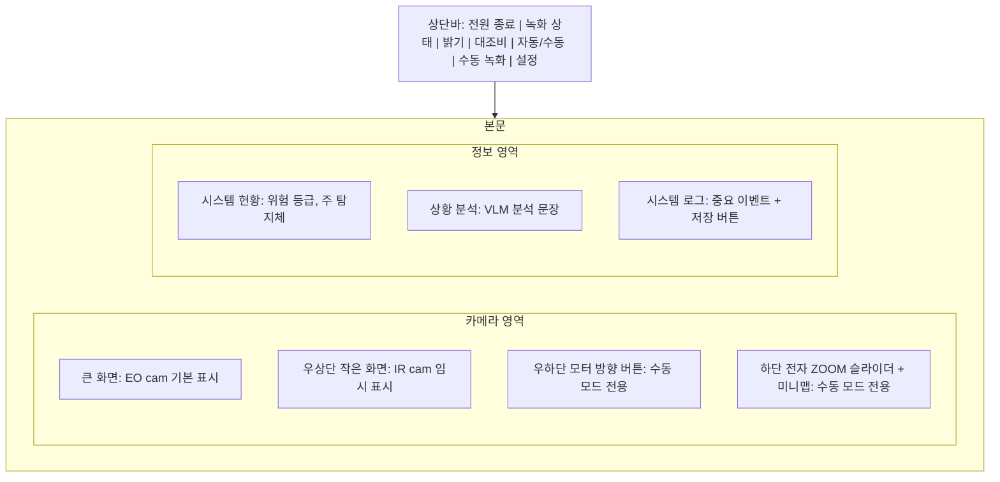
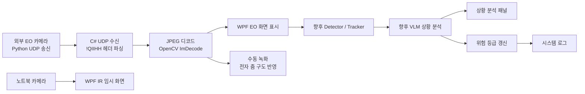

# LIG_DNA_GUI

WPF + Material Design 기반 EO/IR 영상 관제 GUI 프로토타입

현재 구조는 외부 EO 카메라 영상을 UDP로 수신하고, IR 화면은 노트북 카메라를 임시 출력.
이후 VLM/탐지기/모터 제어기와 연결해 객체 인식, 위험도 판단, 전자 줌, 수동 녹화, 시스템 로그 저장을 확장하는 것을 목표

## 현재 기능

- `EO cam`: 외부 UDP JPEG 영상 수신 및 표시
- `IR cam`: 노트북 카메라 임시 입력 표시
- `화면 스왑`: 작은 화면 클릭 시 큰 화면과 교체
- `자동/수동 모드`: 자동 모드 기본 실행, 수동 모드에서 전자 줌/수동 녹화/모터 사용 (모터는 이후 개발 예정)
- `전자 ZOOM`: 수동 모드에서 슬라이더, 마우스 휠, 드래그 패닝 지원
- `줌 미니맵`: 전자 줌 중 현재 보고 있는 영역 표시
- `밝기/대조비`: 상단바 슬라이더로 EO 영상 보정
- `수동 녹화`: 수동 모드에서 EO 영상 녹화, 현재 전자 줌 구도 반영 (현재 바탕화면에 파일 저장)
- `시스템 현황`: 위험 등급과 주 탐지체 표시 (이후 개발 예정)
- `상황 분석`: 향후 VLM 분석 문장 표시 영역 (이후 개발 예정)
- `시스템 로그`: 중요한 이벤트만 기록하고 바탕화면 텍스트 파일로 저장 (이후 고도화 예정, 현재 바탕화면에 파일 저장)
- `테마`: Windows 시스템 테마를 따라 다크/라이트 모드로 시작, 설정창에서 수동 변경 가능

## 화면 구성

캡처 이미지가 아닌 현재 GUI 구조를 단순화한 그림임.



## 데이터 흐름



## 외부 시스템 연동 데이터

### 1. EO 외부 카메라 UDP 영상

현재 C# 수신부는 Python `struct.pack("!QIIHH", ...)` 기준으로 구현되어 있음. `!`는 실제 데이터 바이트가 아니라 네트워크 바이트 오더 지정자임.

| 항목 | 타입 | 크기 | 설명 |
| --- | --- | ---: | --- |
| `utc_time` | `uint64` | 8 byte | 이미지 촬영 UTC 시간 |
| `frame_index` | `uint32` | 4 byte | 프레임 순서 동기화 값 |
| `image_byte_length` | `uint32` | 4 byte | JPEG 이미지 바이트 길이 |
| `width` | `uint16` | 2 byte | 이미지 너비 |
| `height` | `uint16` | 2 byte | 이미지 높이 |
| `image_bytes` | `byte[]` | 가변 | JPEG 인코딩 이미지 바이트 |

송신 예시:

```python
header = struct.pack("!QIIHH", utc_time, frame_index, len(jpeg_bytes), width, height)
sock.sendto(header + jpeg_bytes, ("<GUI_PC_IP>", 5000))
```

현재 수신 조건:

- 기본 포트: `UDP 5000`
- 바디 형식: JPEG 바이트
- 현재 가정: `20바이트 헤더 + JPEG 한 장`이 UDP 데이터그램 하나에 모두 포함됨
- 큰 JPEG를 여러 UDP 패킷으로 나눠 보내는 경우: 향후 프레임 재조립 로직 추가 필요

### 2. IR 임시 카메라

| 항목 | 현재 값 | 설명 |
| --- | --- | --- |
| 입력 장치 | 노트북 기본 카메라 index `0` | 실제 IR 카메라 연결 전 GUI 테스트용 |
| 출력 | WPF `BitmapSource` | 작은 인셋 화면 또는 스왑 시 큰 화면에 표시 |
| 향후 교체 | 실제 IR 카메라 SDK/RTSP/UDP 입력 | 외부 IR 장비 확정 후 서비스 교체 가능 |

### 3. VLM 상황 분석

VLM은 직접 영상 화면을 그리는 역할보다, 탐지/추적 결과와 프레임 메타데이터를 받아 상황 분석 문장과 위험 등급을 생성하는 역할로 연결하는 것이 적합함.

권장 입력:

```json
{
  "timestamp": "2026-04-10T10:05:08+09:00",
  "frame_index": 12345,
  "camera_id": "EO-01",
  "primary_target": "공중 무기체계",
  "detections": [
    {
      "track_id": "T-001",
      "class": "uav",
      "confidence": 0.94,
      "bbox": { "x": 620, "y": 152, "width": 140, "height": 82 },
      "velocity": { "dx": -12.3, "dy": 4.8 }
    }
  ]
}
```

권장 출력:

```json
{
  "timestamp": "2026-04-10T10:05:09+09:00",
  "summary": "EO 영상에서 공중 표적으로 보이는 객체 1개가 확인됨.",
  "threat_level": "medium",
  "recommended_action": "수동 모드에서 대상 중심 확대 후 추적 유지 권장."
}
```

GUI 반영:

| VLM 출력 | GUI 반영 위치 |
| --- | --- |
| `summary` | 상황 분석 패널 |
| `threat_level` | 시스템 현황 위험 등급 LED |
| `recommended_action` | 상황 분석 또는 시스템 로그 |
| 고위험 판단 | 향후 자동 녹화 트리거 |

### 4. 탐지/추적 오버레이

향후 Detector/Tracker가 객체 좌표를 제공하면 EO/IR 화면 위에 채움 없는 사각형과 라벨을 표시할 계획임.

권장 데이터:

```json
{
  "camera_id": "EO-01",
  "frame_index": 12345,
  "objects": [
    {
      "track_id": "T-001",
      "label": "UAV",
      "confidence": 0.94,
      "bbox": { "x": 620, "y": 152, "width": 140, "height": 82 },
      "threat_level": "high"
    }
  ]
}
```

표시 규칙:

| 위험 등급 | 박스/텍스트 색 |
| --- | --- |
| 낮음 | 초록 |
| 중간 | 노랑 |
| 높음 | 빨강 |

### 5. 모터 제어

현재 모터 버튼은 UI 시뮬레이션 값만 변경함. 실제 모터 연동 시에는 수동 모드에서만 명령을 송신하는 구조가 적합함.

권장 명령:

```json
{
  "command": "motor_move",
  "direction": "left",
  "step": 1,
  "mode": "manual",
  "timestamp": "2026-04-10T10:06:00+09:00"
}
```

제어 규칙:

- 자동 모드: 모터 버튼 숨김
- 수동 모드: 모터 상/하/좌/우 버튼 표시
- 기체 고정 또는 자동 추적 모드가 추가될 경우: 버튼 활성 조건 별도 분리 가능

### 6. 로그 저장

시스템 로그는 현재 바탕화면에 텍스트 파일로 저장함.

파일명 형식:

```text
system_log_yyyyMMdd_HHmmss.txt
```

로그에 남길 이벤트 예시:

- 위험 등급 변경
- 수동 녹화 시작/종료
- EO UDP 첫 프레임 수신
- IR 임시 카메라 연결 실패
- 주 탐지체 변경
- VLM 고위험 분석 결과 수신

## 코드 구조

| 파일 | 역할 |
| --- | --- |
| `BroadcastControl.App/App.xaml` | Material Design 리소스와 공통 색상 리소스 정의 |
| `BroadcastControl.App/App.xaml.cs` | 시스템 테마 감지, 다크/라이트 테마 적용 |
| `BroadcastControl.App/MainWindow.xaml` | 전체 GUI 레이아웃과 스타일 정의 |
| `BroadcastControl.App/MainWindow.xaml.cs` | ViewModel과 영상 입력/녹화/설정창 애니메이션 연결 |
| `BroadcastControl.App/ViewModels/MainViewModel.cs` | 화면 상태, 버튼 명령, 로그, 줌, 테마 상태 관리 |
| `BroadcastControl.App/Services/UdpEncodedVideoReceiverService.cs` | EO UDP 영상 수신, JPEG 디코드, 전자 줌 구도 녹화 |
| `BroadcastControl.App/Services/WebcamCaptureService.cs` | IR 임시 노트북 카메라 프레임 입력 |
| `BroadcastControl.App/Infrastructure/RelayCommand.cs` | WPF Command 바인딩용 공통 명령 클래스 |

## 개발 메모
