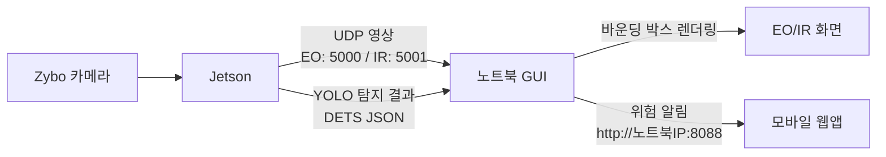
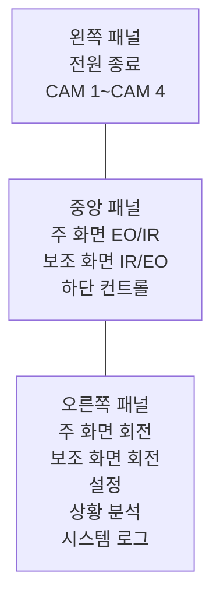

# LIG DNA GUI

운용통제용 WPF GUI 프로젝트입니다. Jetson/Zybo 쪽에서 들어오는 EO/IR 영상과 YOLO 탐지 결과를 GUI에서 표시하고, 위험 상황이 발생하면 모바일 웹앱으로 위험 화면, VLM 분석, 탐지 내용을 알림으로 전달합니다.

## 현재 구성



## 주요 기능

- EO/IR 영상 표시
  - Jetson에서 전송한 JPEG UDP 프레임을 GUI에서 수신해 표시합니다.
  - EO 화면을 주 화면으로, IR 화면을 보조 화면으로 표시합니다.
  - 주 화면/보조 화면 전환과 각각의 화면 회전을 지원합니다.

- YOLO 탐지 결과 표시
  - GUI가 탐지 결과 좌표를 받아 현재 영상 위에 직접 바운딩 박스를 그립니다.
  - 탐지 좌표는 원본 이미지 기준 픽셀 좌표를 그대로 사용합니다.
  - 라벨은 `className`, 신뢰도는 `score`, 객체 ID는 `objectId`를 표시합니다.

- 위험 등급 및 시스템 현황
  - 탐지 객체가 있으면 위험 등급을 `높음`으로 반영합니다.
  - 탐지 객체가 없으면 위험 등급을 `낮음`으로 반영합니다.
  - 전원 종료 버튼과 시스템 현황에는 위험 등급 색상 원형 표시가 함께 표시됩니다.
  - 시스템 현황에는 위험 등급과 주 탐지체만 간단히 표시합니다.

- 녹화
  - 녹화 버튼은 자동/수동 모드와 상관없이 항상 사용할 수 있습니다.
  - 자동 모드에서 위험 등급이 한 번 `높음`이 되면 녹화를 시작합니다.
  - 위험 등급이 잠깐 `낮음`으로 내려가도 자동으로 녹화를 멈추지 않습니다.
  - 녹화는 사용자가 `녹화 종료` 버튼을 눌러야 종료됩니다.

- 전자 ZOOM, 밝기, 대조비
  - 전자 ZOOM은 자동/수동 모드와 상관없이 전원이 켜져 있으면 사용할 수 있습니다.
  - 배율은 `x1.00` 형식으로 표시됩니다.
  - 밝기/대조비 슬라이더와 전자 ZOOM 슬라이더는 하단 컨트롤 패널에서 조작합니다.

- 모바일 웹앱 알림
  - GUI 실행 시 모바일 알림 웹앱이 `8088` 포트에서 함께 시작됩니다.
  - 같은 네트워크의 모바일 기기에서 `http://<노트북 IP>:8088`로 접속합니다.
  - 위험 발생 시 모바일 웹앱으로 다음 항목을 전송합니다.
    - YOLO 바운딩 박스가 표시된 위험 화면 캡처
    - VLM 분석
    - 탐지 내용
  - 모바일 웹앱에서는 영상 아래에 `VLM 분석`과 `탐지 내용`을 별도 카드로 분리해 표시합니다.
  - 모바일 브라우저에서 알림음/진동 활성화 버튼을 누르면 이후 위험 발생 시 소리와 진동으로 알림을 받을 수 있습니다.

## GUI 화면 구성



하단 컨트롤 패널에는 다음 기능이 배치되어 있습니다.

- 대조비
- 자동/수동 모드
- 밝기
- 전자 ZOOM 및 배율 표시
- 녹화 시작/종료
- 영상 녹화 상태
- 시스템 현황

## 입력 데이터 형식

### UDP 영상 패킷

GUI는 JPEG 영상 패킷을 다음 구조로 수신합니다.

```text
[20바이트 헤더] + [JPEG 바이트]
```

헤더 포맷:

```text
!QIIHH
```

| 필드 | 타입 | 설명 |
| --- | --- | --- |
| `frame_stamp_ns` | `uint64` | 프레임 타임스탬프 |
| `frame_index` | `uint32` | 프레임 번호 |
| `image_byte_length` | `uint32` | JPEG 바이트 길이 |
| `width` | `uint16` | 원본 이미지 너비 |
| `height` | `uint16` | 원본 이미지 높이 |

기본 포트:

| 영상 | 포트 |
| --- | --- |
| EO | `5000` |
| IR | `5001` |

### YOLO 탐지 패킷

현재 GUI는 ROS2 토픽 브릿지를 자동 실행하지 않고, UDP로 들어오는 탐지 패킷을 기준으로 바운딩 박스를 표시합니다.

탐지 패킷 구조:

```text
[4바이트 magic = DETS] + [UTF-8 JSON]
```

JSON 예시:

```json
{
  "stampNs": 1713582000000000000,
  "frameId": 123,
  "width": 1280,
  "height": 720,
  "detections": [
    {
      "className": "person",
      "score": 0.91,
      "x1": 210,
      "y1": 130,
      "x2": 320,
      "y2": 410,
      "objectId": 1
    }
  ]
}
```

좌표 규칙:

- `x1`, `y1`: 좌상단
- `x2`, `y2`: 우하단
- 단위: 원본 이미지 기준 픽셀
- GUI는 별도 역변환 없이 해당 좌표를 영상 위에 표시합니다.

## 모바일 알림 데이터

위험 발생 시 모바일 웹앱으로 전달되는 데이터는 다음처럼 분리됩니다.

| 항목 | 설명 |
| --- | --- |
| `title` | 알림 제목 |
| `threatLevel` | 위험 등급 |
| `evidenceUrl` | 위험 화면 캡처 이미지 URL |
| `vlmAnalysis` | VLM 분석 문장 |
| `detectionSummary` | 탐지 객체 목록, 신뢰도, bbox 좌표 |

모바일 웹앱 주소:

```text
http://<노트북 IP>:8088
```

예시:

```text
http://192.168.1.94:8088
```

## 실행 방법

### GUI 실행

```powershell
cd "C:\Users\buguen\Documents\New project"
dotnet run --project .\BroadcastControl.App\BroadcastControl.App.csproj
```

### 빌드 확인

```powershell
cd "C:\Users\buguen\Documents\New project"
dotnet build .\BroadcastControl.App\BroadcastControl.App.csproj -c Debug -p:UseAppHost=false
```

## 코드 구조

| 파일 | 역할 |
| --- | --- |
| `BroadcastControl.App/MainWindow.xaml` | GUI 레이아웃, 카메라 화면, 컨트롤 패널, 설정 창 |
| `BroadcastControl.App/MainWindow.xaml.cs` | UDP 영상/탐지 이벤트 연결, 바운딩 박스 렌더링, 모바일 알림 전송, 녹화 처리 |
| `BroadcastControl.App/ViewModels/MainViewModel.cs` | 화면 상태, 위험 등급, 녹화 상태, 모드, 로그, 설정 값 관리 |
| `BroadcastControl.App/Services/UdpEncodedVideoReceiverService.cs` | UDP 영상 및 탐지 패킷 수신, JPEG 디코딩 |
| `BroadcastControl.App/Services/ViewportRecordingService.cs` | 현재 GUI 화면 녹화 저장 |
| `BroadcastControl.App/Services/MobileAlertHubService.cs` | 모바일 웹앱 HTTP/SSE 서버, 위험 알림 전송 |
| `BroadcastControl.App/Services/UdpMotorControlService.cs` | 수동 모드 모터 제어 패킷 전송 |
| `BroadcastControl.App/Infrastructure/RelayCommand.cs` | WPF Command 바인딩 공통 구현 |

## 현재 주의사항

- 모바일 알림을 받으려면 노트북과 모바일 기기가 같은 네트워크에 있어야 합니다.
- Windows 방화벽에서 `8088`, `5000`, `5001` 포트가 막혀 있으면 영상이나 모바일 웹앱 접속이 실패할 수 있습니다.
- 모바일 브라우저의 알림음/진동은 사용자 터치 이후에만 허용되는 경우가 많으므로 웹앱에서 활성화 버튼을 먼저 눌러야 합니다.
- 자동 녹화는 위험 발생 후 사용자가 끄기 전까지 유지됩니다.
- 창 모드에서 창 크기를 줄이면 전체 UI가 기준 해상도에 맞춰 비례 축소됩니다.
