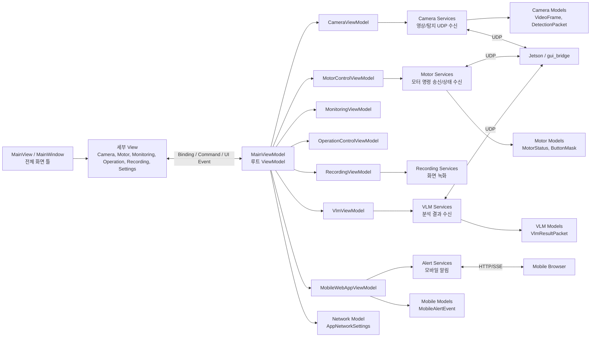

# LIG DNA GUI

Windows WPF 기반 EO/IR 감시 GUI입니다. Jetson/ROS2 브릿지에서 들어오는 EO/IR 영상, YOLO 탐지 결과, VLM 분석 결과, 모터 상태, 녹화 영상 목록을 표시하고, GUI에서 선택한 모터/추적 명령을 Jetson으로 전송합니다.

## 전체 통신 흐름

```text
EO/IR Camera, YOLO, VLM, Motor
        |
        v
Jetson / ROS2 / gui_bridge
        |
        |  UDP 6000  : EO JPEG 영상
        |  UDP 6001  : IR JPEG 영상
        |  UDP 6002  : EO/IR YOLO 탐지 결과
        |  UDP 6003  : VLM 분석 결과
        |  UDP 8001  : 모터 상태
        |  HTTP 8090 : 녹화 영상 목록/다운로드
        v
BroadcastControl.App
        |
        |  UDP 8000  : GUI 모터/추적 명령
        v
Jetson / ROS2 Motor Control
```

## MVVM 아키텍처

이 프로젝트는 `MainView(MainWindow)`가 전체 화면을 배치하고, 각 세부 View가 `MainViewModel`을 통해 기능별 ViewModel에 연결되는 구조입니다. 각 기능별 ViewModel은 자기 기능의 Service를 소유하고 실행하며, Service는 UDP/HTTP/파일 처리 후 Model 데이터를 ViewModel에 전달합니다.


```mermaid
flowchart LR
    MainView["MainView / MainWindow<br/>전체 화면 틀"] --> Views["세부 View<br/>Camera, Motor, Monitoring, Operation, Recording, Settings"]

    Views <-->|Binding / Command / UI Event| MainVM["MainViewModel<br/>루트 ViewModel"]

    MainVM --> CameraVM["CameraViewModel"]
    MainVM --> MotorVM["MotorControlViewModel"]
    MainVM --> MonitoringVM["MonitoringViewModel"]
    MainVM --> OperationVM["OperationControlViewModel"]
    MainVM --> RecordingVM["RecordingViewModel"]
    MainVM --> VlmVM["VlmViewModel"]
    MainVM --> MobileVM["MobileWebAppViewModel"]

    CameraVM --> CameraSvc["Camera Services<br/>영상/탐지 UDP 수신"]
    MotorVM --> MotorSvc["Motor Services<br/>모터 명령 송신/상태 수신"]
    RecordingVM --> RecordingSvc["Recording Services<br/>화면 녹화"]
    VlmVM --> VlmSvc["VLM Services<br/>분석 결과 수신"]
    MobileVM --> AlertSvc["Alert Services<br/>모바일 알림"]

    CameraSvc --> CameraModel["Camera Models<br/>VideoFrame, DetectionPacket"]
    MotorSvc --> MotorModel["Motor Models<br/>MotorStatus, ButtonMask"]
    VlmSvc --> VlmModel["VLM Models<br/>VlmResultPacket"]
    MobileVM --> MobileModel["Mobile Models<br/>MobileAlertEvent"]
    MainVM --> NetworkModel["Network Model<br/>AppNetworkSettings"]

    CameraSvc <-->|UDP| Jetson["Jetson / gui_bridge"]
    MotorSvc <-->|UDP| Jetson
    VlmSvc <-->|UDP| Jetson
    AlertSvc <-->|HTTP/SSE| Mobile["Mobile Browser"]
```

## Binding / Subscribe / Update / Command

```text
MainWindow.xaml
  -> 세부 View 배치

세부 View
  -> XAML Binding으로 MainViewModel 상태 표시
  -> 버튼/마우스/키보드 이벤트를 Command 또는 이벤트로 전달

MainViewModel
  -> CameraViewModel, MotorControlViewModel, RecordingViewModel, VlmViewModel 등을 소유
  -> 공통 표시 상태와 기능별 ViewModel을 View에 제공

세부 ViewModel
  -> 자기 기능의 Service를 생성/실행/해제
  -> Service 결과를 화면 표시용 상태로 변환
  -> PropertyChanged로 View 갱신

세부 Service
  -> UDP/HTTP/파일/녹화 처리
  -> Model 데이터로 파싱 또는 직렬화

세부 Model
  -> 영상 프레임, 탐지 객체, 모터 상태, VLM 결과, 네트워크 설정 데이터 정의
```

| 흐름 | 담당 위치 | 설명 |
| --- | --- | --- |
| Binding | `Views/*.xaml` -> `MainViewModel` | 화면 텍스트, 이미지, 상태, 리스트, 버튼 활성 여부를 표시합니다. |
| Subscribe | 각 기능별 ViewModel의 Service | 카메라 영상, 탐지 결과, 모터 상태, VLM 결과 수신 서비스를 실행합니다. |
| Update | `MainViewModel` 및 기능별 ViewModel | 수신된 Model 데이터를 화면 표시용 속성으로 변환하고 `PropertyChanged`를 발생시킵니다. |
| Command | View의 버튼/키 입력 -> ViewModel/Service | 모터 이동, Motor Speed 변경, 녹화, 설정 저장, 테마/언어 변경을 처리합니다. |
| Link | `MainWindow.xaml` / `MainViewModel` | 세부 View를 화면에 올리고 세부 ViewModel과 Service 계층을 연결합니다. |

## 주요 폴더

| 경로 | 역할 |
| --- | --- |
| `BroadcastControl.App` | Windows WPF GUI 애플리케이션 |
| `BroadcastControl.App/Views` | 기능별 UserControl 화면 |
| `BroadcastControl.App/ViewModels` | 화면 상태, Command, 기능별 Service 소유 계층 |
| `BroadcastControl.App/Models` | UDP/HTTP/설정/상태 데이터 구조 |
| `BroadcastControl.App/Services` | 통신, 영상 수신, 모터, 녹화, VLM, 모바일 알림 처리 |
| `BroadcastControl.App/Infrastructure` | 공통 WPF 유틸리티 |
| `JetsonThor.RosCameraBridge` | Jetson ROS2 토픽을 GUI UDP/HTTP로 변환하는 브릿지 |
| `BroadcastControl.UdpBenchmark` | UDP 수신 성능 확인 도구 |

## BroadcastControl.App 구조

```text
BroadcastControl.App/
  App.xaml
  App.xaml.cs
  MainWindow.xaml
  MainWindow.xaml.cs

  Infrastructure/
    RelayCommand.cs

  Views/
    Camera/
    Monitoring/
    Motor/
    Operation/
    Recording/
    Settings/
    Vlm/

  ViewModels/
    MainViewModel.cs
    ViewModelBase.cs
    Camera/
      CameraViewModel.cs
    Mobile/
      MobileWebAppViewModel.cs
    Monitoring/
      MonitoringViewModel.cs
    Motor/
      MotorControlViewModel.cs
    Operation/
      OperationControlViewModel.cs
    Recording/
      RecordingViewModel.cs
    Vlm/
      VlmViewModel.cs

  Services/
    Alert/
    Camera/
    Monitoring/
    Motor/
    Network/
    Recording/
    Vlm/

  Models/
    Camera/
    Mobile/
    Motor/
    Network/
    Vlm/
```

## ViewModel 역할

| 파일 | 역할 |
| --- | --- |
| `ViewModels/MainViewModel.cs` | 루트 ViewModel입니다. 세부 ViewModel을 소유하고 공통 상태, Command, 로그, 언어/테마 상태를 제공합니다. |
| `ViewModels/ViewModelBase.cs` | `INotifyPropertyChanged`와 `SetProperty`를 제공하는 공통 기반 클래스입니다. |
| `ViewModels/Camera/CameraViewModel.cs` | EO/IR 영상 수신 서비스, 탐지 결과 수신 서비스, 줌/팬/회전/밝기/대비 상태를 관리합니다. |
| `ViewModels/Motor/MotorControlViewModel.cs` | 모터 명령 송신 서비스와 모터 상태 수신 서비스를 소유하고 Pan/Tilt, 방향키, 각도 입력, Motor Speed를 관리합니다. |
| `ViewModels/Operation/OperationControlViewModel.cs` | Scan/Manual 모드, Tracking, 주 탐지체, 테마, 언어, 네트워크 설정 상태를 관리합니다. |
| `ViewModels/Recording/RecordingViewModel.cs` | 수동 화면 녹화 서비스와 녹화 상태, 녹화 영상 목록 표시 상태를 관리합니다. |
| `ViewModels/Vlm/VlmViewModel.cs` | VLM 결과 수신 서비스를 소유하고 위험도, 분석 문장, 객체별 위험도 상태를 관리합니다. |
| `ViewModels/Mobile/MobileWebAppViewModel.cs` | 모바일 위험 알림 HTTP/SSE 서버와 최신 증거 이미지 URL을 관리합니다. |
| `ViewModels/Monitoring/MonitoringViewModel.cs` | System Status, YOLO Targets, 시스템 로그 표시 데이터를 관리합니다. |

## Service 역할

| 파일 | 역할 |
| --- | --- |
| `Services/Camera/UdpEncodedVideoReceiverService.cs` | EO/IR JPEG UDP 프레임을 수신, 조립, 디코딩하고 탐지/status 패킷을 파싱합니다. |
| `Services/Camera/DetectionOverlayService.cs` | 영상 표시 영역 기준 바운딩 박스 좌표를 계산합니다. |
| `Services/Motor/UdpMotorControlService.cs` | GUI에서 Jetson으로 모터/추적 UDP 명령을 전송합니다. |
| `Services/Motor/MotorPacketSerializer.cs` | 모터 명령 값을 Jetson 규격의 UDP 패킷으로 직렬화합니다. |
| `Services/Motor/UdpMotorStatusReceiverService.cs` | Jetson 모터 상태 UDP 패킷을 수신하고 파싱합니다. |
| `Services/Recording/ViewportRecordingService.cs` | GUI 카메라 표시 영역을 AVI 파일로 녹화합니다. |
| `Services/Vlm/UdpVlmResultReceiverService.cs` | VLM 분석 결과 UDP 패킷을 수신하고 파싱합니다. |
| `Services/Alert/MobileAlertHubService.cs` | 모바일 위험 알림용 HTTP/SSE 서버를 제공합니다. |
| `Services/Network/UdpReceiverService.cs` | 범용 UDP 수신 기능을 제공합니다. |
| `Services/Network/UdpSenderService.cs` | 범용 UDP 송신 기능을 제공합니다. |
| `Services/Monitoring/SystemLogService.cs` | 시스템 로그 이벤트를 전달합니다. |

## 통신 포트

| 포트 | 방향 | 기능 |
| --- | --- | --- |
| `6000/udp` | Jetson -> GUI | EO JPEG 영상 프레임 |
| `6001/udp` | Jetson -> GUI | IR JPEG 영상 프레임 |
| `6002/udp` | Jetson -> GUI | EO/IR YOLO 탐지 결과 |
| `6003/udp` | Jetson/VLM -> GUI | VLM 분석 결과 |
| `8000/udp` | GUI -> Jetson | 모터/추적 명령 |
| `8001/udp` | Jetson -> GUI | 모터 상태 |
| `8090/http` | Jetson -> GUI | 녹화 영상 목록/다운로드 |

## 영상 수신 형식

EO/IR 영상은 raw image가 아니라 JPEG로 압축된 프레임입니다. Jetson 브릿지가 각 프레임을 JPEG로 인코딩한 뒤 UDP 청크로 나누어 보내고, GUI가 같은 frame id의 청크를 모아 JPEG를 복원한 다음 WPF 이미지로 표시합니다.

```text
ROS Image
  -> JPEG 압축
  -> UDP 청크 분할
  -> GUI UDP 수신
  -> JPEG 조립/디코딩
  -> View 표시
```

## 모터 명령 패킷

GUI는 Jetson의 `8000/udp`로 모터 명령 패킷을 보냅니다. Pan/Tilt 각도는 GUI에서 degree로 표시하지만 전송 시 raw step으로 변환됩니다.

```text
raw = deg / 360.0 * 4096.0
```

최종 전송값은 `0~4095` 범위로 제한합니다.

## 빌드

```powershell
dotnet build BroadcastControl.slnx -c Debug
```

이미 패키지가 복원된 상태에서 빠르게 확인할 때는 다음 명령을 사용합니다.

```powershell
dotnet build BroadcastControl.slnx -c Debug --no-restore
```
